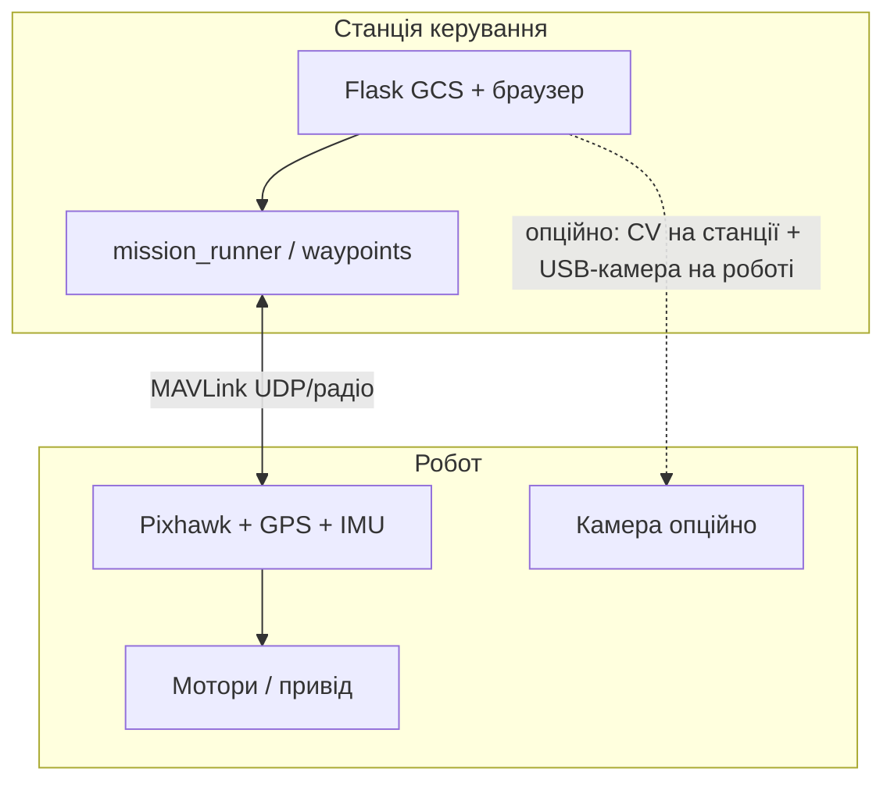
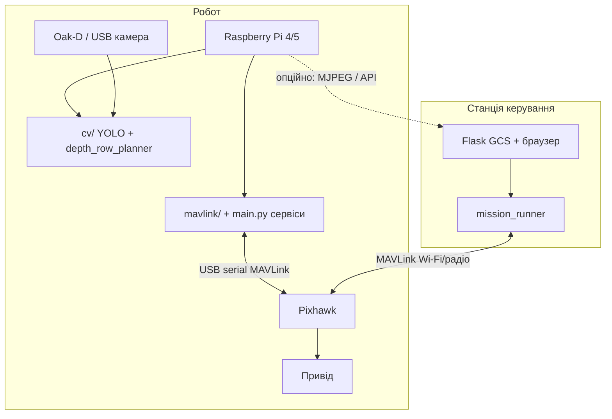

# Розгортання: Pixhawk vs Raspberry Pi + станція керування

Документ для проєкту **Autonomous Ground Rover System** (`autonomous_drone_system`).  
Порівнює два типові варіанти **бортової** частини при однаковій **наземній станції** (GCS).

> **Варіант 2 vs 3** (RPi+Pixhawk vs тільки RPi) і **чекліст закупівлі:** [`DEPLOYMENT_VARIANT_2_VS_3.md`](DEPLOYMENT_VARIANT_2_VS_3.md)

Поточний dev-режим (`python main.py --full`) об’єднує симулятор, Flask і CV на одному ПК — це **не** польова схема, а зручність розробки.

---

## Спільне для обох варіантів: станція керування (GCS)

| Компонент | Призначення |
|-----------|-------------|
| Ноутбук / планшет оператора | Робоче місце в полі |
| Браузер → `http://<host>:8080/` | UI: карта, маршрут, HUD, CV-вікно |
| `main.py --web` | Flask API (`web/`), без симулятора |
| `web/mission_runner.py` | GPS-маршрут: точки 1→2→…→N, стоп, повернення |
| `web/static/js/gcs.js` | Автономний / ручний режим, редагування маршруту |
| QGroundControl (опційно) | Калібрування FC, резервний моніторинг MAVLink |
| `config/system.yaml` | `connection_px4` / телеметрія до робота |
| Симулятор, pytest, git | **Лише на станції** (розробка), не на роботі в полі |

**Не на станції в «ідеальному» полі:** важкий CV на кожен кадр, якщо камера стоїть на роботі (див. варіант 2).

Зв’язок станція ↔ робот: **MAVLink** (UDP/Wi‑Fi, радіомодем 3DR / SiK, Ethernet) + за потреби **відеопотік** (MJPEG/RTSP).

---

## Варіант 1 — Pixhawk-центричний

### Ідея

**Pixhawk (ArduPilot Rover / PX4)** — головний «мозок» руху: GPS, IMU, failsafe, guided, швидкість.  
Комп’ютер на роботі **мінімальний або відсутній**; розумні функції частково на **станції**.

### Схема



### Що встановлювати

| Місце | ПЗ / прошивка |
|-------|----------------|
| **Pixhawk** | ArduPilot Rover (рекомендовано для ground rover) або PX4; прошивка через QGC |
| **Pixhawk** | Параметри rover, GPS, EKF, failsafe, режими GUIDED / AUTO |
| **Робот (опційно)** | MAVLink Wi‑Fi/радіо модуль (підключений до TELEM порту FC) |
| **Робот (опційно)** | Камера → **довгий USB** або IP-камера → **станція** (не FC) |
| **Станція** | Ubuntu / Windows + Python venv, `requirements.txt` |
| **Станція** | `python main.py --web`, `MAVLINK_PROFILE=px4` |
| **Станція** | Увесь репозиторій, `config/`, моделі YOLO **якщо CV на станції** |
| **Станція** | QGroundControl |

**На Pixhawk не ставлять:** Python, Flask, YOLO, ваш `main.py`.

### Як лягає на ваш код

| Модуль проєкту | Варіант 1 |
|----------------|-----------|
| `mavlink/ground_controller.py` | Запуск на **станції**, з’єднання з FC по радіо |
| `web/mission_runner.py` | **Станція** → `goto_latlon` / guided на Pixhawk |
| `cv/tracker.py` | Типово **станція** (камера через USB/IP з робота) або вимкнено в полі |
| `simulator/` | Лише dev на станції |
| `simulator/registry.py` | Не використовується в полі (немає in-process sim) |

### Плюси

- Перевірена архітектура для наземних роботів (ArduPilot Rover).
- Failsafe, ARM/DISARM, GPS на залізі, що для цього призначене.
- Менше витрат/складності на борту (без Jetson/RPi).
- Станція може бути потужнішою для YOLO (GPU ноутбука).
- QGC — стандарт для налаштування.

### Мінуси

- **CV на станції** + камера на роботі → затримка, кабель USB/Ethernet, ризик обриву.
- Слідування рядом (`cv/depth_row_planner`) гірше, ніж локально на борту.
- Навантаження на **радіоканал** (MAVLink + відео).
- Менше автономності при втраті зв’язку (якщо немає companion).

### Коли обирати

- Бюджетний прототип, короткі ряди, **маршрут по GPS** важливіший за CV-ряд.
- Вже є Pixhawk + QGC-досвід.
- Камера тимчасово на ноутбуці оператора (варіант B з README).

---

## Варіант 2 — Raspberry Pi (companion) + Pixhawk

### Ідея

**RPi на роботі** — companion computer: камера, CV, локальний MAVLink-клієнт.  
**Pixhawk** лишається виконавцем руху (мотори, GPS, failsafe).  
**Станція** — планування, моніторинг, ручне керування, без обов’язкового YOLO.

Це **рекомендована** схема для виноградника з `planner: hybrid` у `config/cv.yaml`.

### Схема



### Що встановлювати

| Місце | ПЗ / прошивка |
|-------|----------------|
| **Pixhawk** | Те саме, що в варіанті 1 (прошивка rover, GPS) |
| **RPi** | Raspberry Pi OS 64-bit (Bookworm), Python 3.10+ |
| **RPi** | venv + `requirements.txt` (ultralytics, opencv, depthai, pymavlink, flask **за потреби**) |
| **RPi** | `models/*.pt`, `config/cv.yaml` → `source: oakd` або `webcam` |
| **RPi** | Сервіс: `main.py --cv` або окремий скрипт CV → `MotionBridge` → MAVLink |
| **RPi** | `mavlink` на `serial:/dev/ttyACM0` або `udp:127.0.0.1:14550` + mavlink-router |
| **RPi** | systemd-юніти для автозапуску після увімкнення |
| **Станція** | `python main.py --web` **без** `--cv` (або лише перегляд потоку) |
| **Станція** | Повний GCS, mission, логи; `connection_px4` → телеметрія FC |

**На RPi зазвичай не ставлять:** повноцінний Leaflet-GCS для оператора (достатньо легкого API або stream).

**На станції зазвичай не ставлять:** обов’язковий YOLO (якщо CV на RPi).

### Як лягає на ваш код

| Модуль | Варіант 2 |
|--------|-----------|
| `cv/tracker.py` + `depth_row_planner.py` | **RPi** (камера локально) |
| `web/motion_bridge.py` | **RPi** → локальний MAVLink до FC |
| `web/mission_runner.py` | **Станція** (команди по телеметрії до того ж FC) |
| `web/` Flask GCS | **Станція** |
| `config/system.yaml` | Два профілі: RPi `mavlink` serial; GCS `connection_px4` udp |

### Плюси

- Низька затримка **слідування рядом** (hybrid depth/YOLO).
- Oak-D / камера без довгого USB до ноутбука.
- Станція може бути слабшим ноутбуком (браузер + MAVLink).
- При розриві Wi‑Fi до станції можна зберегти **локальний** ряд-CV (якщо реалізовано failsafe на борту).
- Відповідає архітектурі з [`ARCHITECTURE.md`](ARCHITECTURE.md) (Phase 1: Python + MAVLink + CV).

### Мінуси

- Два «мозки»: RPi + Pixhawk — складніша інтеграція та діагностика.
- RPi слабкий для великих YOLO-моделей → `yolo_device: cpu` або легка модель; Jetson краще для GPU.
- Живлення, охолодження, вібрація, SD-карта на полі.
- Потрібен **MAVLink routing** (щоб і RPi, і станція не конфліктували) — mavlink-router / forwarding.
- Дублювання: mission зі станції і CV з RPi — узгодження режимів (у вас уже є `control_mode` + блок CV при активному маршруті).

### Коли обирати

- Автономне **оприскування вздовж рядів** (CV + GPS).
- Камера Oak-D на платформі.
- Планується регулярна робота в полі, не разовий демо-запуск.

---

## Порівняльна таблиця

| Критерій | Варіант 1: Pixhawk-центричний | Варіант 2: RPi + Pixhawk |
|----------|-------------------------------|---------------------------|
| Бортовий «мозок» руху | Pixhawk | Pixhawk (виконавець) + RPi (CV/логіка) |
| CV / ряд | Станція (або немає) | **RPi** |
| GCS / карта / маршрут | Станція | Станція |
| Складність збірки | Нижча | Середня / вища |
| Вартість борту | Нижча | RPi + камера + блок живлення |
| Затримка CV | Вища | Нижча |
| Failsafe GPS/ARM | Сильний (FC) | Сильний (FC) |
| Dev у репо (`--full`) | Близько до вар. 1 (все на ПК) | Розділити: RPi `--cv`, GCS `--web` |
| Типовий MAVLink | Станція → FC | RPi → FC serial; Станція → FC radio |
| Рекомендація для виноградника | GPS-маршрут, прототип | **Продакшн-ціль** |

---

## Розподіл ПО (підсумкова матриця)

| ПЗ | Pixhawk (залізо) | RPi | Станція |
|----|------------------|-----|---------|
| ArduPilot / PX4 | ✅ | — | QGC |
| Python + `autonomous_drone_system` | — | ✅ (CV + MAVLink) | ✅ (GCS + mission) |
| YOLO / `cv/` | — | ✅ | ⚠️ лише перегляд потоку |
| Flask `web/` GCS | — | ⚠️ опційно API | ✅ |
| `mission_runner` | — | — | ✅ |
| Симулятор | — | — | ✅ dev |
| `config/cv.yaml` oakd | — | ✅ | копія для налаштування |
| `config/system.yaml` | — | ✅ (serial) | ✅ (udp телеметрія) |

---

## Приклад мережі MAVLink (варіант 2)

1. Pixhawk `TELEM1` ↔ радіомодем ↔ **ноутбук станції** (`udp:127.0.0.1:14550` або IP модема).
2. Pixhawk `USB` ↔ **RPi** (`/dev/ttyACM0`, 115200) — локальні команди CV.
3. На RPi: **mavlink-router** ретранслює або окремий порт для GCS.

Параметр у `config/system.yaml` на станції:

```yaml
mavlink:
  active: px4
  connection_px4: "udp:192.168.x.x:14550"   # IP радіо на роботі / наземної антени
```

На RPi (окремий конфіг або env):

```yaml
mavlink:
  active: px4
  connection_px4: "serial:/dev/ttyACM0:115200"
```

---

## Етапи впровадження (з поточного `--full`)

| Крок | Дія |
|------|-----|
| 1 | Залишити розробку на ПК: `python main.py --full` |
| 2 | Підключити реальний Pixhawk, `MAVLINK_PROFILE=px4`, QGC — калібрування |
| 3a | **Варіант 1:** камера + `main.py --web --cv` на станції |
| 3b | **Варіант 2:** перенести `main.py --cv` на RPi, на станції лише `--web` |
| 4 | Поле: перевірити стоп, останню точку, перемикач CV (див. GCS) |
| 5 | Phase 2 (опційно): ROS 2 з `src/drone_*` — діагностика, не заміна GCS |

---

## Рекомендація для цього проєкту

| Ціль | Варіант |
|------|---------|
| Швидко показати маршрут по GPS, мінімум заліза | **1 — Pixhawk + станція** |
| Виноградник, hybrid CV, Oak-D, стабільне поле | **2 — RPi + Pixhawk + станція** |
| Розробка без заліза | ПК `--full` (як зараз) |

Обидва варіанти **не виключають** Pixhawk: у варіанті 2 RPi **доповнює**, а не замінює автопілот.  
Повна заміна Pixhawk одним лише RPi (без FC) — окрема архітектура (GPIO/PWM), **не** покривається поточним `mavlink/` стеком без переробки.

---

## Пов’язані файли репозиторію

- [`ARCHITECTURE.md`](ARCHITECTURE.md) — шари системи  
- [`QUICKSTART.md`](QUICKSTART.md) — dev-запуск  
- [`config/system.yaml`](../config/system.yaml) — MAVLink і web  
- [`config/cv.yaml`](../config/cv.yaml) — planner, камера  
- [`README.md`](../README.md) — огляд стеку  

---

*Документ створено для планування розгортання; параметри IP/портів узгоджуються з реальним радіомодемом і схемою підключення TELEM/USB.*
