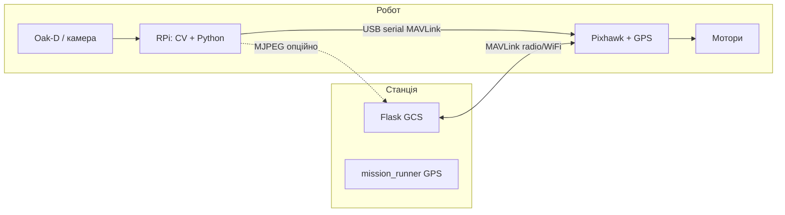
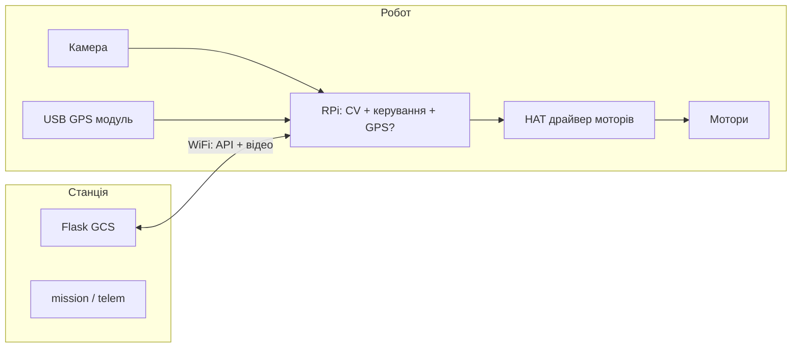

# Варіант 2 vs Варіант 3 + чекліст закупівлі заліза

Проєкт: **Autonomous Ground Rover System**  
Станція керування (GCS) — **спільна** для обох варіантів (ноутбук + браузер + `python main.py --web`).

> **Активний вибір проєкту: варіант 2.** Покроковий запуск: [`VARIANT_2_SETUP.md`](VARIANT_2_SETUP.md)

| Варіант | Борт |
|---------|------|
| **2** | **Raspberry Pi** (companion) + **Pixhawk** (автопілот руху) |
| **3** | **Тільки Raspberry Pi** (без Pixhawk) — RPi керує моторами напряму |

Варіант 1 (лише Pixhawk, CV на станції) — у [`DEPLOYMENT_PIXHAWK_VS_RPI.md`](DEPLOYMENT_PIXHAWK_VS_RPI.md).

---

## Станція керування (однакова для 2 і 3)

| Компонент | Призначення |
|-----------|-------------|
| Ноутбук (i5/Ryzen 5+, 16 GB RAM) | GCS, карта, логи; опційно перегляд відео |
| ОС | Ubuntu 22.04 LTS або Windows 11 + WSL2 для dev |
| Wi‑Fi / радіомодем | Зв’язок з роботом |
| Браузер | `http://<IP_станції або робота>:8080/` |
| Python venv + репозиторій | `pip install -r requirements.txt` |
| QGroundControl | **Варіант 2 — так** (Pixhawk). **Варіант 3 — ні** (немає FC) |

---

## Варіант 2 — RPi + Pixhawk + станція

### Схема

### Розподіл ПО

| ПЗ | RPi | Pixhawk | Станція |
|----|-----|---------|---------|
| ArduPilot Rover / PX4 | — | ✅ прошивка | QGC |
| `cv/` (YOLO + depth hybrid) | ✅ | — | перегляд потоку |
| `mavlink/` + `main.py --cv` | ✅ → локально до FC | — | — |
| `web/mission_runner` | — | — | ✅ |
| Flask GCS | — | — | ✅ |
| `simulator/` | — | — | dev |

### Плюси

- **Покриває поточний код** без переробки драйверів (`mavlink/`, `goto_latlon`, ARM, failsafe FC).
- Надійний **GPS, EKF, failsafe, DISARM** на автопілоті.
- CV на борту — низька затримка для рядів виноградника.
- QGC — стандарт калібрування та польотних логів.
- При втраті Wi‑Fi до станції FC може зупинитися за параметрами (FS).

### Мінуси

- Два контролери: складність монтажу, живлення, налагодження.
- Потрібен **MAVLink router** або чітке розділення: RPi → serial до FC, станція → radio до FC.
- Вартість Pixhawk + GPS-модуль + RPi.
- RPi обмежений для великих YOLO — легка модель або Jetson замість RPi.

### Готовність репозиторію

| Функція | Статус |
|---------|--------|
| GPS-маршрут | ✅ `mission_runner` + MAVLink |
| CV ряд | ✅ `cv/` + `config/cv.yaml` |
| Ручний / автономний режим | ✅ GCS |
| Симулятор без заліза | ✅ `main.py --full` |

**Рекомендація:** цільове польове розгортання для цього проєкту.

---

## Варіант 3 — тільки RPi (без Pixhawk) + станція

### Схема

### Розподіл ПО (цільовий — не все є в репо зараз)

| ПЗ | RPi | Станція |
|----|-----|---------|
| `cv/` | ✅ | перегляд |
| Flask GCS | ⚠️ можна на RPi **або** станції | ✅ |
| `mavlink/ground_controller` | ❌ немає FC | не використовується |
| **Новий шар** `drivers/motors` (GPIO/PWM, I2C) | ✅ потрібна розробка | — |
| **Новий** GPS (pyserial, ublox) | ✅ замість MAVLink GPS | — |
| `mission_runner` | ⚠️ переписати на локальні координати / без `goto_latlon` | команди по HTTP/MAVLink-custom |
| QGC | ❌ | — |

### Плюси

- **Нижча вартість** (немає Pixhawk, телеметрії FC).
- Один комп’ютер на борту — простіша схема «все в Python».
- Менше кабелів (немає FC ↔ RPi MAVLink).
- Повний контроль логіки в коді (для досвідченої команди).

### Мінуси

- **Не підтримується поточним кодом** — потрібна окрема фаза розробки (тижні, не дні).
- Немає промислового failsafe рівня ArduPilot (потрібно проектувати: стоп при втраті зв’язку, e-stop, обмеження швидкості).
- GPS на USB (NEO-M8N тощо) слабший за RTK-модуль на FC; складніше точне оприскування по рядках.
- Немає готового guided/offboard — треба писати PID / pure pursuit самостійно.
- Відповідальність за безпеку (рух моторів) повністю на вашому софті.
- Складніше сертифікувати/пояснити поведінку при збоях.

### Готовність репозиторію

| Функція | Статус |
|---------|--------|
| GPS-маршрут через MAVLink | ❌ |
| CV ряд | ✅ (після адаптації `MotionBridge` → GPIO) |
| ARM/DISARM як у FC | ❌ → власна логіка «увімкнути привід» |
| `main.py --full` симулятор | ✅ не замінює реальні мотори |

**Рекомендація:** лише якщо є досвід embedded + час на драйвери; для швидкого виходу в поле — **варіант 2**.

---

## Порівняння варіант 2 і 3

| Критерій | Варіант 2: RPi + Pixhawk | Варіант 3: тільки RPi |
|----------|--------------------------|------------------------|
| Відповідність **поточному** репо | ✅ Висока | ❌ Низька (новий шар заліза) |
| Вартість борту | Середня / вища | Нижча |
| Складність збірки | Середня | Середня (менше модулів, більше софту) |
| CV на ряд (Oak-D) | ✅ RPi | ✅ RPi |
| GPS-маршрут 1→N | ✅ через FC | ⚠️ USB GPS + свій код |
| Failsafe / e-stop | ✅ ArduPilot | ⚠️ свій дизайн |
| QGC / калібрування | ✅ | ❌ |
| Затримка керування рядом | Низька (RPi → FC local) | Низька (RPi → GPIO) |
| Два канали зв’язку (RPi+radio) | Так (потрібен router) | Простіше (один IP) |
| Масштабування (RTK, кілька роботів) | Краще | Складніше |
| Час до першого поля | Тижні | Місяці+ |
| Живлення | FC + RPi (~5 V + 5 V/12 V) | RPi + драйвер (~5 V + 12 V мотори) |
| Типовий розмір команди | 1–2 інж. + оператор | 2+ embedded/Python |

### Коли обрати

| Ситуація | Вибір |
|----------|--------|
| Виноградник, hybrid CV, маршрут по GPS, проєкт уже на MAVLink | **Варіант 2** |
| Дуже обмежений бюджет, маленький робот, без RTK, є embedded-розробник | **Варіант 3** (з планом розробки) |
| Потрібен швидкий demo для гранту / диплому на існуючому коді | **Варіант 2** |
| Навчальний робот у класі, без QGC | Можливо **варіант 3** |

---

## Чекліст закупівлі заліза

Орієнтовні кількості — **1 робот + 1 станція**. Ціни не вказані (залежать від регіону); пріоритет: **must** / **should** / **optional**.

### Спільне — станція керування (варіанти 2 і 3)

| № | Позиція | К-ть | Пріоритет | Примітки |
|---|---------|------|-----------|----------|
| G1 | Ноутбук (16 GB RAM, SSD 256 GB+) | 1 | must | GCS, QGC (вар. 2), dev |
| G2 | Зарядка / Power bank для ноутбука (поле) | 1 | should | 4–6 год роботи |
| G3 | Смартфон / планшет (резервний браузер) | 1 | optional | Якщо ноутбук недоступний |
| G4 | Кейс / сумка для ноутбука | 1 | should | Пил, волога |
| G5 | USB-флешка / SSD з backup образом | 1 | should | Відновлення системи |

---

### Варіант 2 — борт (RPi + Pixhawk)

#### Автопілот і навігація

| № | Позиція | К-ть | Пріоритет | Примітки |
|---|---------|------|-----------|----------|
| 2B1 | **Pixhawk** (Cube Orange / Pixhawk 4 / Kakute H7 WP — rover-сумісний) | 1 | must | Перевірити ArduPilot Rover |
| 2B2 | GPS + компас (модуль для FC, M8N/M9N) | 1 | must | Виносити від EMI моторів |
| 2B3 | GPS-мачта / винесення 15–30 см | 1 | must | |
| 2B4 | Кабель GPS → FC | 1 | must | Зазвичай в комплекті |
| 2B5 | USB-кабель FC → RPi (micro USB / Type-C) | 1 | must | MAVLink serial |
| 2B6 | Картка microSD для FC (32 GB, industrial) | 1 | must | Логи ArduPilot |
| 2B7 | Датчик напруги / струму (power module) | 1 | must | Безпека батареї |
| 2B8 | Buzzer + кнопка безпеки (safety switch) | 1 | should | ArduPilot standard |

#### Обчислення та зір

| № | Позиція | К-ть | Пріоритет | Примітки |
|---|---------|------|-----------|----------|
| 2B9 | **Raspberry Pi 4 (4 GB)** або **Pi 5 (4–8 GB)** | 1 | must | Pi 5 — швидше; потрібен охолодження |
| 2B10 | microSD 64–128 GB A2 / або SSD USB | 1 | must | Краще SSD для YOLO |
| 2B11 | Блок живлення RPi 5 V 5 A (офіційний або якісний) | 1 | must | |
| 2B12 | Радіатор / вентилятор для RPi | 1 | should | Літо в полі |
| 2B13 | **OAK-D** або OAK-D Lite (Luxonis) | 1 | must | `config/cv.yaml` → `oakd` |
| 2B14 | USB-кабель OAK-D → RPi (USB3) | 1 | must | Короткий, екранований |
| 2B15 | Кріплення камери (кут ~15–30° вперед) | 1 | must | Стабільність важлива |

#### Зв’язок

| № | Позиція | К-ть | Пріоритет | Примітки |
|---|---------|------|-----------|----------|
| 2B16 | Телеметрія **3DR / SiK** 915 МГц (пара air+ground) або Wi‑Fi router | 1 | must | Станція ↔ FC |
| 2B17 | Антени telemetry (2 dBi+) | 2 | must | |
| 2B18 | Wi‑Fi точка доступу на роботі (опційно) | 1 | optional | MJPEG + API без radio |
| 2B19 | Ethernet кабель (debug в полі) | 1 | optional | Налаштування RPi |

#### Привід і шасі

| № | Позиція | К-ть | Пріоритет | Примітки |
|---|---------|------|-----------|----------|
| 2B20 | Шасі rover (4WD або диференційне 2WD) | 1 | must | Під вагу батареї + обладнання |
| 2B21 | ESC / драйвер моторів (сумісний з FC) | 1 комплект | must | ArduPilot SERVO outputs |
| 2B22 | BLDC / DC мотори + колеса | 4 або 2 | must | |
| 2B23 | Акумулятор LiPo 3S/4S (ємність за вагою) | 1–2 | must | + запасна should |
| 2B24 | Зарядник LiPo balance | 1 | must | |
| 2B25 | Кнопка **аварійного стопу** (розмикання живлення моторів) | 1 | must | Апаратний e-stop |
| 2B26 | Реле оприскувача (12 V) + форсунка / помпа | 1 | should | Якщо оприскування в ТЗ |

#### Монтаж

| № | Позиція | К-ть | Пріоритет | Примітки |
|---|---------|------|-----------|----------|
| 2B27 | Корпус / полікарбонат для електроніки (IP54+) | 1 | should | Пил, обприскування |
| 2B28 | Кабель-стяжки, демпфери, кріплення GPS/камери | — | must | |
| 2B29 | Заземлення / спільна «земля» FC–RPi–живлення | — | must | Уникати ground loop |

---

### Варіант 3 — борт (тільки RPi)

#### Обчислення та зір (як у вар. 2)

| № | Позиція | К-ть | Пріоритет | Примітки |
|---|---------|------|-----------|----------|
| 3B1 | Raspberry Pi 4/5 (4–8 GB) | 1 | must | |
| 3B2 | microSD / SSD USB | 1 | must | |
| 3B3 | Блок живлення RPi 5 V 5 A | 1 | must | |
| 3B4 | OAK-D / OAK-D Lite + кріплення | 1 | must | |
| 3B5 | Радіатор / вентилятор RPi | 1 | should | |

#### Навігація (без Pixhawk)

| № | Позиція | К-ть | Пріоритет | Примітки |
|---|---------|------|-----------|----------|
| 3B6 | USB GPS **u-blox NEO-M8N/M9N** (з антеною) | 1 | must | `mission_runner` потребує нового драйвера |
| 3B7 | USB GPS винесення / мачта | 1 | must | |
| 3B8 | IMU **MPU-9250 / BNO085** (I2C) | 1 | should | Курс між оновленнями GPS |
| 3B9 | Магнітометр (якщо не в IMU) | 1 | optional | |

#### Привід (напряму від RPi)

| № | Позиція | К-ть | Пріоритет | Примітки |
|---|---------|------|-----------|----------|
| 3B10 | HAT драйвер моторів (**RoboHAT**, **Motor HAT**, **L298N** ×2) | 1 | must | PWM + напрям; перевірити струм |
| 3B11 | DC мотори + редуктор + колеса | 4 або 2 | must | |
| 3B12 | Енкодери на колеса (опційно) | 2–4 | optional | Точніший odometry |
| 3B13 | Акумулятор 12 V (для моторів) + UBEC 5 V для RPi | 1 | must | Розділити живлення |
| 3B14 | Аварійний вимикач живлення моторів | 1 | must | |
| 3B15 | Реле оприскувача + помпа | 1 | should | GPIO RPi |
| 3B16 | Шасі | 1 | must | |

#### Зв’язок

| № | Позиція | К-ть | Пріоритет | Примітки |
|---|---------|------|-----------|----------|
| 3B17 | Wi‑Fi 2.4/5 GHz (вбудований RPi + зовнішня антена) | 1 | must | GCS ↔ RPi |
| 3B18 | Wi‑Fi router/mobile hotspot для поля | 1 | should | Стабільний IP |
| 3B19 | Резерв: LoRa / 4G HAT | 1 | optional | Якщо Wi‑Fi слабкий у полі |

#### Монтаж

| № | Позиція | К-ть | Пріоритет | Примітки |
|---|---------|------|-----------|----------|
| 3B20 | Корпус IP54+ для RPi та драйверів | 1 | must | |
| 3B21 | Захист від стрибків напруги (TVS, fuse) | — | must | |
| 3B22 | Кріплення, демпфери | — | must | |

---

### Інструменти та витратні (обидва варіанти)

| № | Позиція | К-ть | Примітки |
|---|---------|------|----------|
| T1 | Паяльник, припій, термоусадка | 1 | |
| T2 | Мультиметр | 1 | |
| T3 | Викрутки, шестигранники, стяжки | — | |
| T4 | Ноутбук з USB для прошивки / налаштування | 1 | вже G1 |
| T5 | Запасні запобіжники, запасні колеса | — | should |
| T6 | Захист очей / рук для LiPo | — | must |

---

## Орієнтовний бюджетний рівень (без цифр)

| Група | Варіант 2 | Варіант 3 |
|-------|-----------|-----------|
| Автопілот + GPS | Висока частка | — |
| RPi + камера | Середня | Середня |
| Привід + батарея | Середня | Середня |
| Зв’язок | Середня | Нижча |
| **Разом** | Зазвичай **вище** | Зазвичай **нижче** |
| **+ розробка** | Нижча | **Вища** |

---

## Мінімальний стартовий набір (MVP)

### Варіант 2 — MVP

1. Pixhawk + GPS + power module + safety  
2. RPi 4 (4 GB) + SD + живлення + OAK-D Lite  
3. Шасі + мотори + ESC + 1× LiPo + зарядка  
4. Telemetry radio (пара)  
5. Ноутбук станції  
6. E-stop  

### Варіант 3 — MVP

1. RPi 4/5 + SD + живлення + OAK-D Lite  
2. Motor HAT + 2–4 мотори + шасі + 12 V + UBEC 5 V  
3. USB GPS M8N + мачта  
4. E-stop на силовому ланцюзі  
5. Ноутбук станції  
6. **+ план розробки** драйверів моторів і GPS у репозиторії  

---

## Наступні кроки в репозиторії

| Варіант | Дія |
|---------|-----|
| **2** | `docs/QUICKSTART.md` → Pixhawk + `MAVLINK_PROFILE=px4`; RPi: `main.py --cv`; GCS: `main.py --web` |
| **3** | Новий модуль `drivers/` (motors, gps); адаптувати `MotionBridge`; документувати failsafe |

---

## Пов’язані документи

- [`DEPLOYMENT_PIXHAWK_VS_RPI.md`](DEPLOYMENT_PIXHAWK_VS_RPI.md) — варіант 1 vs 2  
- [`ARCHITECTURE.md`](ARCHITECTURE.md)  
- [`config/system.yaml`](../config/system.yaml), [`config/cv.yaml`](../config/cv.yaml)  

---

*Чекліст узгоджуйте з місцевими постачальниками (EU/US/UA). Перед замовленням перевірте сумісність HAT з вашою моделлю RPi та струмом моторів.*
