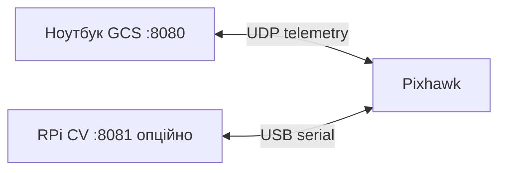

# Варіант 2 — робоче розгортання (RPi + Pixhawk + GCS)

**Цільовий режим проєкту:** бортовий **Raspberry Pi** (CV + MAVLink до FC) + **Pixhawk** (рух, GPS, failsafe) + **станція** (карта, маршрут, оператор).

Документи: [`VARIANT_2_PROCUREMENT.md`](VARIANT_2_PROCUREMENT.md) (**чекліст + ціни**) · [`FIELD_DAY.md`](FIELD_DAY.md) (**полевий день**) · [`DEPLOYMENT_VARIANT_2_VS_3.md`](DEPLOYMENT_VARIANT_2_VS_3.md) · [`DEPLOYMENT_PIXHAWK_VS_RPI.md`](DEPLOYMENT_PIXHAWK_VS_RPI.md).

---

## Розподіл ролей

| Роль | Залізо | ПЗ | Запуск |
|------|--------|-----|--------|
| **Борт CV** | RPi + Oak-D | `cv/` hybrid, `mavlink/` → serial | `scripts/run_variant2_rpi.sh` |
| **Рух / GPS** | Pixhawk | ArduPilot Rover | QGC (калібрування) |
| **Станція** | Ноутбук | Flask GCS, `mission_runner` | `scripts/run_variant2_gcs.sh` |



---

## Підключення (типове)

1. **Pixhawk USB → RPi** — MAVLink (`/dev/ttyACM0`, 115200).
2. **Pixhawk TELEM → радіомодем** — MAVLink до ноутбука (`udp:IP:14550`).
3. **OAK-D → RPi** USB3.
4. **ESC/мотори → Pixhawk** SERVO outputs.
5. **GPS → Pixhawk** (винесення вгору).
6. **E-stop** на силовому ланцюзі моторів.

> Якщо RPi і GCS одночасно підключаються до FC: використайте **mavlink-router** на RPi або лише radio до GCS, а RPi — USB (рекомендовано). Детально: [`MAVLINK_VARIANT2.md`](MAVLINK_VARIANT2.md).

---

## Конфіги у репозиторії

| Файл | Призначення |
|------|-------------|
| [`config/system_rpi.yaml`](../config/system_rpi.yaml) | RPi: `serial:/dev/ttyACM0:115200` |
| [`config/system_gcs.yaml`](../config/system_gcs.yaml) | GCS: `udp:192.168.1.10:14550` — **змініть IP** |
| [`config/cv_rpi.yaml`](../config/cv_rpi.yaml) | `source: oakd`, `planner: hybrid` |
| [`config/cv.yaml`](../config/cv.yaml) | Dev / відео на ПК |

Змінні середовища:

```bash
export SYSTEM_CONFIG=config/system_gcs.yaml   # або system_rpi.yaml
export CV_CONFIG=config/cv_rpi.yaml           # лише на RPi
export MAVLINK_PROFILE=px4
```

---

## Dev на ПК (без заліза)

Як зараз — один комп’ютер, симулятор:

```bash
python main.py --full
# http://127.0.0.1:8080/
```

Це **не** польова схема, але той самий код GCS + CV.

---

## Поле — покроково

### A. Підготовка Pixhawk (один раз)

1. Прошивка **ArduPilot Rover** через QGroundControl.
2. Калібрування RC (якщо є), компас, GPS, ESC.
3. Параметри rover, failsafe (зупинка при втраті GCS за потреби).
4. Перевірка ARM у QGC на столі.

### B. RPi (борт)

```bash
cd ~/autonomous_drone_system
python3 -m venv .venv && source .venv/bin/activate
pip install -r requirements.txt
# моделі YOLO в models/

sudo usermod -aG dialout $USER   # перелогінитись
# перевірити порт:
ls -l /dev/ttyACM0

# у config/system_rpi.yaml виправити serial за потреби
chmod +x scripts/run_variant2_rpi.sh
./scripts/run_variant2_rpi.sh
```

Очікується: `[CV] Oak-D RGB + depth`, рух по ряду через MAVLink.

**Автозапуск (systemd)**:

Є готові файли в репозиторії:

- `deploy/rover-cv.service`
- `deploy/rover-cv.env.example`

Інсталяція на RPi:

```bash
sudo mkdir -p /etc/rover
sudo cp deploy/rover-cv.env.example /etc/rover/rover-cv.env
sudo cp deploy/rover-cv.service /etc/systemd/system/rover-cv.service

sudo systemctl daemon-reload
sudo systemctl enable --now rover-cv.service

# логи
sudo journalctl -u rover-cv -f
```

### C. Станція (GCS)

```bash
# у config/system_gcs.yaml → connection_px4: udp:<IP_робота>:14550
chmod +x scripts/run_variant2_gcs.sh
./scripts/run_variant2_gcs.sh
# за замовч. MONITORING_CONFIG=config/monitoring.field.yaml (uplink.source: rpi)
```

**Польовий старт (менше помилок перед виїздом):**

```bash
chmod +x scripts/start_field.sh
PYTEST_DISABLE_PLUGIN_AUTOLOAD=1 DRONE_SIM_INTERACTIVE=0 bash scripts/start_field.sh
```

Скрипт робить:

- health-check analysis server (якщо `remote.base_url` заданий)
- показує стан офлайн-черги (pending events/captures)
- стартує GCS (`python main.py --web`)

**Режим “CV на борту (RPi)” для GCS:**

У `config/system_gcs.yaml`:

```yaml
cv:
  mode: onboard   # local | onboard
```

У цьому режимі локальний трекер на GCS **заблоковано** (щоб не запускати 2 CV одночасно).

Браузер: **http://127.0.0.1:8080/**

1. У блоці **Моніторинг** вкажіть **Станція** (id) і **Оператор** → **Зберегти** (йдуть на сервер аналізу).
2. Режим **Автономний** → точки на карті → **Старт маршруту**.
3. Або **Ручний** → стрілки; **STOP** / **■ Стоп** зупиняють усе.
4. **CV ряд** на станції — лише якщо CV не на RPi (для вар. 2 зазвичай CV на борту).

**Моніторинг з RPi (Wi‑Fi):** RPi надсилає JPEG на станцію:

```bash
# на RPi (після зйомки лівої/правої камери моніторингу):
python scripts/rpi_monitoring_upload.py \
  --gcs http://192.168.1.50:8080 \
  --vehicle rover_1 --side left --image /tmp/left.jpg
```

На GCS: **Зразок зараз** / **Обстеження** чекають пару left+right (`wait_timeout_s` у `monitoring.field.yaml`).

**Радіус прибуття:** `arrival_radius_m: 2.5` у `system_gcs.yaml` і `system_rpi.yaml` (однаково); dev/sim — `1.0` у `config/system.yaml`.

### D. Перевірки перед рядом

- [ ] QGC бачить GPS fix на Pixhawk  
- [ ] GCS HUD: Connected, координати оновлюються  
- [ ] ARM з GCS або QGC  
- [ ] Короткий рух 1–2 м, **Стоп** зупиняє  
- [ ] Остання точка маршруту — зупинка (phase `at_last`)  
- [ ] E-stop апаратний рве живлення моторів  

---

## Відео на GCS з борту (опційно)

Якщо на RPi підняти лише stream (без повного GCS):

- Тимчасово на RPi: `web.host: 0.0.0.0`, `port: 8081` у `system_rpi.yaml` і `python main.py --web` + `--cv` у окремих процесах, **або**
- Окремий RTSP/MJPEG relay (майбутнє).

Зараз найпростіше: оператор дивиться на ряд з боку; телеметрія в GCS по GPS.

---

## Типові проблеми

| Симптом | Дія |
|---------|-----|
| GCS OFFLINE | IP у `system_gcs.yaml`, firewall, телеметрія |
| RPi serial denied | `dialout`, кабель USB, `connection_px4` |
| CV не стартує | `depthai`, USB3, `cv_rpi.yaml` |
| Конфлікт MAVLink | RPi лише USB, GCS лише radio |
| Маркер їде після кінця | Оновіть код (halt на останній точці), **Стоп** |

---

## Перед виїздом (GCS + RPi)

- GCS: блок **«Перед виїздом»**, експорт/імпорт маршруту JSON, лог сесії — див. [`FIELD_DAY.md`](FIELD_DAY.md)
- RPi: `bash scripts/preflight_variant2.sh`

---

## Що розробляємо далі (варіант 2)

- [ ] Калібрування `connection_px4` під ваше radio  
- [ ] mavlink-router на RPi (за потреби)  
- [ ] systemd на RPi  
- [ ] MJPEG з RPi на GCS (опційно)  
- [ ] RTK GPS (опційно, Phase 2)  

**Не в scope варіант 2:** GPIO-мотори без Pixhawk (це варіант 3).

---

## Швидкі команди

```bash
# Dev
python main.py --full

# Поле — RPi
./scripts/run_variant2_rpi.sh

# Поле — GCS
./scripts/run_variant2_gcs.sh

# Явний конфіг
python main.py --web --config config/system_gcs.yaml
python main.py --cv --config config/system_rpi.yaml
```
